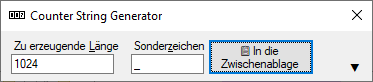
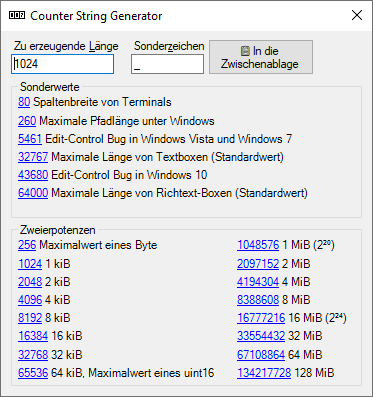

# Counter String Generator

Kopiert Texte in die Zwischenablage für Tests von Anwendungen, bei denen die Länge des Texts eine Rolle spielt.

Anwendungszwecke:

* Ermitteln der maximalen Länge eines Texts in einem Eingabefeld
* Ermitteln der Länge der internen Verarbeitung ("abgeschnittener Text")
* Nachweis von Abstürzen durch Überläufe (Overflow)
* Messen der Verarbeitungszeit langer Texte

## Anwendungshinweise

Der kopierte Text ist so aufgebaut, dass man seine Länge mit wenig Mühe ermitteln kann. Voraussetzung dafür ist, dass der Text der einzige im Textfeld ist. Es bietet sich daher an, zunächst den ganzen Text eines Textfeldes zu markieren (Strg+A) und dann den Counter String einzufügen (Strg+V).

Die Vorgehensweise zum Ermitteln der Länge ist:

1. Suchen Sie das letzte angezeigte Sonderzeichen (`_`)
2. Lesen Sie die Zahl davor ab
3. Addieren Sie die Anzahl der Buchstaben nach dem Sonderzeichen (`_`)

Beispiel:

Angezeigter Text ist  ...`5522_65528_65534_65`. Die Zahl vor dem letzten Unterstrich ist 65534. Danach folgen noch zwei Ziffern. Der Text ist also 65536 Zeichen lang.

## "Bekannte" Längen

Manchmal können Software-Entwickler wenig dafür, dass es Grenzen gibt. Und manchmal sind diese Grenzen den Entwicklern auch gar nicht bekannt. Hier ist eine Liste von einigen Längen, die sich auf die Länge von Text auswirken können.

* 32, 64, 128, 256, ...: typische Zweierpotenzen (2ⁿ) sind für das Anlegen von Puffern beliebt.
* 80: Spaltenbreite mancher Terminals
* 256: manchmal fälschlicherweise anstelle von `MAX_PATH` eingesetzt
* **260**: `MAX_PATH`, ergibt sich aus 256 Zeichen für den Dateinamen, zzgl. 3 Buchstaben für das Laufwerk (`X:\`) und 1 Zeichen für die Terminierung des Strings. Siehe [Maximum Path Length Limitation (Microsoft)](https://docs.microsoft.com/en-us/windows/win32/fileio/maximum-file-path-limitation)
* 1024: typische Größe für Sende- und Empfangspuffer
* 4096: typische Größe einer auslagerungsfähigen Seite unter Windows. Siehe [SYSTEM_INFO (Microsoft)](https://docs.microsoft.com/en-us/windows/win32/api/sysinfoapi/ns-sysinfoapi-system_info). Verursacht eher selten Probleme.
* **5461**: einzeilige Textfelder in Windows Vista und Windows 7 zeigen den Text nicht mehr an. 5460 Zeichen werden noch dargestellt. Betrifft das CEdit-Control von MFC.
  Fragen auf StackOverflow dazu: [1](https://stackoverflow.com/questions/206600/setlimittext-in-a-cedit-in-vista-does-not-work), [2](https://stackoverflow.com/questions/10361855/winform-textbox-cant-display-text)
* **32767**: Standardwert für die maximale Länge von Textfeldern in .NET WinForms sowie vermutlich weitere. Siehe [EM_SETLIMITTEXT (Microsoft)](https://docs.microsoft.com/en-us/windows/win32/Controls/em-setlimittext)
* **43680**: einzeilige Textfeldern in Windows 10 zeigen den Text nicht mehr an. 43679 Zeichen werden noch dargestellt. Ähnlich dem 5461-Problem von Windows Vista.
* **64000**: Standardwert für Rich-Edit-Controls. Siehe [EM_SETLIMITTEXT (Microsoft)](https://docs.microsoft.com/en-us/windows/win32/Controls/em-setlimittext)
* 65536: typische Größe eines einzeln anforderbaren Speicherblocks mittels [VirtualAlloc() (Microsoft)](https://docs.microsoft.com/en-us/windows/win32/api/memoryapi/nf-memoryapi-virtualalloc). Verursacht eher selten Probleme.